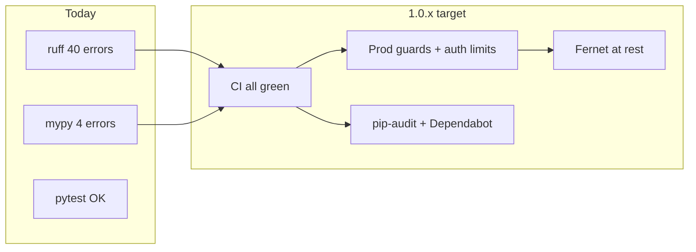

# Nakatomi 1.0.x ship-readiness plan

**Scope:** CI + security + supply chain + email-at-rest encryption + docs (your choice). **Out of scope:** open [ROADMAP.md](ROADMAP.md) product items (MCP resources, A2A client, custom-field validation, etc.) and items marked deferred/out of scope.

**Current state on `main`:** `[test](.github/workflows/ci.yml)` passes; `**lint` and `typecheck` fail** (last green path blocked before `docker` build on push). Tests: ~150+ with Postgres in CI.




---

## Phase 1 — Unblock CI (release **1.0.1**)

**Goal:** `ruff check`, `ruff format --check`, `mypy app`, and `pytest` all pass locally and on GitHub Actions.

### 1.1 Ruff (40 errors, mostly mechanical)

Run `ruff check --fix .` and `ruff format .` per [pyproject.toml](pyproject.toml).

Known hotspots from failed run `[31185842133](https://github.com/mrdulasolutions/NakatomiCRM/actions/runs/31185842133)`:


| Area                                                                                                                                                                                                   | Issue                                            |
| ------------------------------------------------------------------------------------------------------------------------------------------------------------------------------------------------------ | ------------------------------------------------ |
| [app/mcp_server.py](app/mcp_server.py)                                                                                                                                                                 | Unused `Product` import                          |
| [app/routers/forecast.py](app/routers/forecast.py), [forensics.py](app/routers/forensics.py), [leads.py](app/routers/leads.py), [views.py](app/routers/views.py), [welcome.py](app/routers/welcome.py) | F401 unused imports                              |
| [app/services/*](app/services/) importers, forensics, calendar_io, company_merge                                                                                                                       | F401                                             |
| [app/services/memory/adapters/gbrain.py](app/services/memory/adapters/gbrain.py)                                                                                                                       | UP038 `isinstance` tuples → `|` unions (2 lines) |
| [tests/test_email_calendar.py](tests/test_email_calendar.py)                                                                                                                                           | Unused `pytest` import                           |


**Acceptance:** `ruff check .` and `ruff format --check .` exit 0.

### 1.2 Mypy (4 errors in 2 files)

Fix typing without weakening [tool.mypy](pyproject.toml):


| File                                                                 | Fix direction                                                                                                                                             |
| -------------------------------------------------------------------- | --------------------------------------------------------------------------------------------------------------------------------------------------------- |
| [app/services/email_io.py](app/services/email_io.py) ~L136           | `get_payload(decode=True)` may be non-`bytes` — guard with `isinstance(payload, bytes)` before `.decode()` (mirror the non-multipart branch at L139–141). |
| [app/services/calendar_io.py](app/services/calendar_io.py) ~L178–179 | Assign `dtstart`/`dtend` to locals; call `.isoformat()` only when `datetime`.                                                                             |
| [app/services/calendar_io.py](app/services/calendar_io.py) ~L221     | `existing.subject` may be `None` — use `(ev.get("summary") or existing.subject or "")[:500]` (same pattern for body).                                     |


**Acceptance:** `mypy app` exit 0.

### 1.3 Release hygiene

- Move existing **[Unreleased]** bullets in [CHANGELOG.md](CHANGELOG.md) (MCP custom fields) into **1.0.1** with a **Fixed** section (CI/lint/mypy).
- Bump [pyproject.toml](pyproject.toml) `version` to `1.0.1` (keep `app/__init__.py` `__version__` in sync if defined there).
- Optional: fix README CI badge to point at the real workflow (currently claims passing while Actions is red).

**PR:** single PR `fix/ci: ruff + mypy green` → tag **v1.0.1**.

---

## Phase 2 — Supply chain and CI maintenance (release **1.0.2**)

### 2.1 Dependabot

Add [.github/dependabot.yml](.github/dependabot.yml):

- **pip** — weekly, `requirements.txt` / [pyproject.toml](pyproject.toml) ecosystem
- **github-actions** — weekly, bump `[.github/workflows/ci.yml](.github/workflows/ci.yml)` pins

### 2.2 `pip-audit` in CI

New step in the `test` job (after `pip install -r requirements.txt`):

```bash
pip install pip-audit
pip-audit -r requirements.txt
```

Fail the job on **Critical/High** (adjust if a transitive pin needs a documented exception in SECURITY.md).

### 2.3 GitHub Actions

Bump `actions/checkout` and `actions/setup-python` to current major versions to clear Node 20 deprecation warnings from the failed run logs.

**PR:** `ci: dependabot + pip-audit + action bumps` → tag **v1.0.2**.

---

## Phase 3 — Production security hardening (release **1.0.3**)

Align code, CLI, and docs with [SECURITY.md](SECURITY.md), [docs/DEPLOY.md](docs/DEPLOY.md), and Railway template docs.

### 3.1 Centralize bootstrap secret in settings

Today `[BOOTSTRAP_TOKEN](app/routers/welcome.py)` is read via `os.getenv` only — not in [app/config.py](app/config.py) or [.env.example](.env.example).

- Add `BOOTSTRAP_TOKEN: str = ""` to `Settings`.
- Wire [welcome.py](app/routers/welcome.py) `_check_token` to `settings.BOOTSTRAP_TOKEN`.
- Document in `.env.example`, [docs/RAILWAY_TEMPLATE.md](docs/RAILWAY_TEMPLATE.md), and DEPLOY production checklist: **set on any public URL that may sit idle before claim**.

### 3.2 Expand `python -m app check-config`

Extend [app/cli.py](app/cli.py) `cmd_check_config` when `ENVIRONMENT` is `production`/`prod`:


| Condition                                             | Severity                                 |
| ----------------------------------------------------- | ---------------------------------------- |
| Weak/default `SECRET_KEY`                             | **issue** (partially exists)             |
| `CORS_ORIGINS == "*"` with credentials enabled in app | **warning** (recommend explicit origins) |
| `API_KEY_RATE_LIMIT_PER_MINUTE <= 0`                  | **warning** (recommend e.g. 120/min)     |
| Empty `BOOTSTRAP_TOKEN`                               | **warning** (public deploy race)         |
| Empty `PUBLIC_BASE_URL` when SSO env vars set         | **warning**                              |


Do **not** hard-fail boot on `CORS=*` (would break existing Railway headless deploys); mirror the existing pattern: **boot guard only for `SECRET_KEY`**, operator signal via `check-config`.

Add tests in `tests/test_cli.py` (or new file) for production warning matrix.

### 3.3 Auth and bootstrap rate limiting (close SECURITY.md “known gap” for unauthenticated endpoints)

Implement a **small in-process middleware** in [app/main.py](app/main.py) (new module e.g. [app/middleware_auth_limit.py](app/middleware_auth_limit.py)):

- Settings: `AUTH_RATE_LIMIT_PER_MINUTE: int = 0` (0 = disabled, same semantics as API keys in [app/deps.py](app/deps.py)).
- Paths: `POST /auth/login`, `POST /auth/signup`, `POST /bootstrap` (and welcome form POST if it hits bootstrap).
- Key: client IP from `request.client.host`, honoring `X-Forwarded-For` first hop when present (consistent with `--proxy-headers` in [railway.toml](railway.toml) / Dockerfile).
- Response: **429** + `Retry-After`, same style as API key limiter.
- Document limitation: **per-process memory** (fine for single-instance Railway; not a cluster-wide limit without Redis later).

Tests: burst requests exceed limit; disabled when `AUTH_RATE_LIMIT_PER_MINUTE=0`.

Update [SECURITY.md](SECURITY.md) scope: unauthenticated auth/bootstrap brute force moves from “known gap” to “mitigated when limit enabled”; keep DoS-by-volume as out of scope.

### 3.4 Documentation pass (no behavior surprises)

- [.env.example](.env.example): `BOOTSTRAP_TOKEN`, `API_KEY_RATE_LIMIT_PER_MINUTE`, `AUTH_RATE_LIMIT_PER_MINUTE`, comment on production CORS.
- [docs/DEPLOY.md](docs/DEPLOY.md) production table: recommended values for limits + bootstrap.
- [docker-compose.yml](docker-compose.yml): comment that published `5432` and default DB password are **dev-only** (no change required for local DX).
- [README.md](README.md): one line under Deploy — run `python -m app check-config` before going public.

**PR:** `sec: bootstrap settings, auth rate limit, check-config` → tag **v1.0.3**.

---

## Phase 4 — Email credentials at rest (release **1.0.4**)

Fulfill the documented debt in [app/models.py](app/models.py) (`EmailConfig` plaintext passwords).

### 4.1 Crypto helper

Add functions in [app/security.py](app/security.py) (or `app/secret_box.py`):

- Derive a Fernet key from `SECRET_KEY` (stable across restarts; document that **rotating `SECRET_KEY` requires re-saving email config**).
- Prefix ciphertext: `enc:v1:` + Fernet token; **plaintext legacy rows still decrypt/read** until next PUT.

`cryptography` is already available via `python-jose[cryptography]` in [requirements.txt](requirements.txt).

### 4.2 Write path / read path

- [app/routers/email.py](app/routers/email.py) `put_config`: encrypt `imap_password` / `smtp_password` when non-empty before `setattr`.
- [app/services/email_io.py](app/services/email_io.py): decrypt immediately before `imap.login` / `smtp.login`.
- [app/schemas.py](app/schemas.py) `EmailConfigOut`: keep **not** returning passwords (already correct).

### 4.3 Schema migration

- New Alembic revision (e.g. `0016_email_secrets_widen`): widen password columns to `Text` if Fernet payloads exceed 255 chars.
- Optional data migration step: encrypt existing rows in-place (safe to run twice with idempotent `enc:v1:` check).

### 4.4 Tests

Extend [tests/test_email_calendar.py](tests/test_email_calendar.py):

- PUT config → DB stores `enc:v1:` prefix; poll/send still works with mocked IMAP/SMTP.
- Legacy plaintext row still polls after helper decrypt path.

**PR:** `sec: encrypt EmailConfig passwords at rest` → tag **v1.0.4**.

---

## Execution order and PR strategy


| Order | PR                                          | Release | Risk                                   |
| ----- | ------------------------------------------- | ------- | -------------------------------------- |
| 1     | CI lint + mypy                              | 1.0.1   | Low                                    |
| 2     | Dependabot + pip-audit + actions            | 1.0.2   | Low                                    |
| 3     | Auth limit + settings + check-config + docs | 1.0.3   | Medium (new middleware)                |
| 4     | Email encryption + migration                | 1.0.4   | Medium (DB + SECRET_KEY rotation note) |


Run full CI locally before each PR:

```bash
pip install -r requirements.txt
ruff check . && ruff format --check .
mypy app
pytest --cov=app   # with TEST_DATABASE_URL / Postgres as in CI
python -m app check-config
```

After **1.0.1**, confirm GitHub Actions `docker` job runs on push to `main` again (currently skipped when lint fails).

---

## Post-ship (optional, not in this plan)

- Per-key **burst** limits (ROADMAP P3.1) — separate epic.
- Redis-backed rate limits for multi-replica deploys.
- Close remaining ROADMAP `[ ]` items under **1.1+** when you expand scope beyond ship-readiness.

