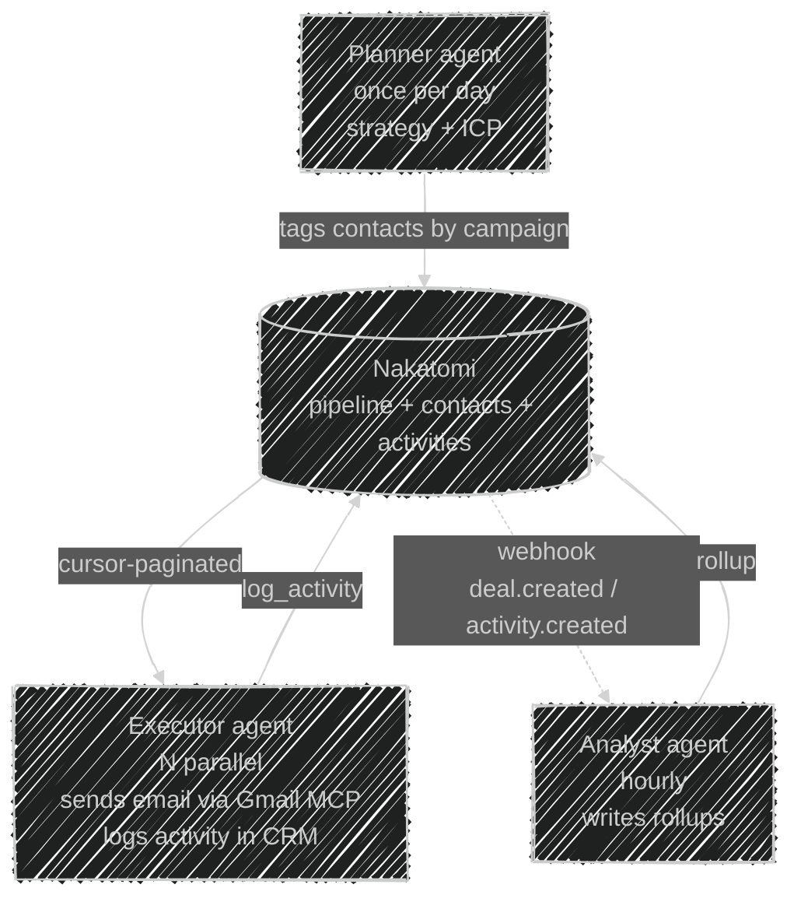
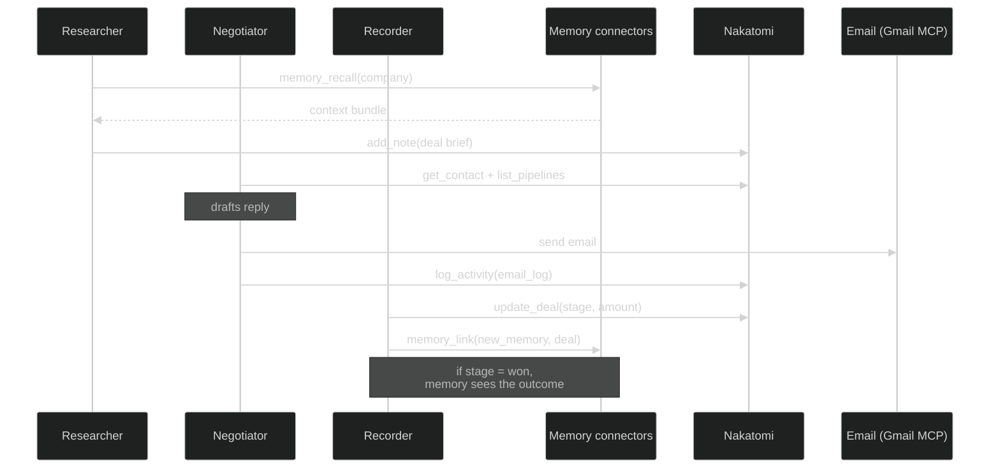

# AgentLab

> Recipes, blueprints, and opinions on how to point AI agents at Nakatomi
> and end up with a working go-to-market operation — not a demo.
>
> If you build a new pattern that works, PR it in. The lab compounds.

**Table of contents**

- [The frame](#the-frame)
- [Solo agent patterns](#solo-agent-patterns)
  - [24/7 autonomous SDR](#1-247-autonomous-sdr)
  - [Autonomous AE](#2-autonomous-ae)
  - [Research agent](#3-research-agent)
  - [Morning briefing agent](#4-morning-briefing-agent)
- [Team & swarm patterns](#team--swarm-patterns)
  - [Outbound campaign machine](#5-outbound-campaign-machine)
  - [End-to-end deal orchestration](#6-end-to-end-deal-orchestration)
  - [Inbound triage + routing swarm](#7-inbound-triage--routing-swarm)
  - [Territory-aware swarm](#8-territory-aware-swarm)
  - [Post-call follow-up swarm](#9-post-call-follow-up-swarm)
- [Harness recipes](#harness-recipes)
  - [Claude Desktop / Claude Code](#claude-desktop--claude-code)
  - [Cursor](#cursor)
  - [ChatGPT Custom GPTs](#chatgpt-custom-gpts)
  - [Perplexity Spaces](#perplexity-spaces)
  - [Hermes / OpenClaw agents](#hermes--openclaw-agents)
- [Connector chains](#connector-chains)
  - [Nakatomi + Gmail / Hostinger](#nakatomi--gmail--hostinger)
  - [Nakatomi + Google Calendar](#nakatomi--google-calendar)
  - [Nakatomi + Slack](#nakatomi--slack)
  - [Nakatomi + Apollo / Hubspot / ImportYeti](#nakatomi--apollo--hubspot--importyeti)
  - [Nakatomi + memory systems](#nakatomi--memory-systems)
- [Skills that pair with Nakatomi](#skills-that-pair-with-nakatomi)
- [Cost & ops model](#cost--ops-model)
- [Anti-patterns](#anti-patterns)

---

## The frame

Nakatomi does one thing well: it stores structured facts about your go-to-market
(people, companies, deals, pipelines, tasks, activities, files, relationships,
timeline). Nothing else. Email lives elsewhere. Calendar lives elsewhere.
Semantic memory lives in DocDeploy / Supermemory / GBrain. Chat lives in Slack.

The pattern that falls out: **agents are the glue**. They read their own
memory and their own tools, act on the world, then record the structured
residue in Nakatomi. Nakatomi isn't a workflow engine — it's the spine that
every agent and every human can look at to agree on what happened.

That means the best agent designs for Nakatomi have three properties:

1. **Read before write.** Always call `describe_schema` + `timeline` on an
   entity before mutating it. Prevents drift, enables deduplication, keeps the
   timeline coherent.
2. **External-id everything.** If the agent is syncing from Apollo, HubSpot,
   Gmail, LinkedIn, whatever — set `external_id` from the source system.
   Re-runs become idempotent; bulk operations stop creating duplicates.
3. **Log the touchpoint, not the intention.** `log_activity(kind="call", ...)`
   after the call happened. Don't fabricate activities you "would have done."
   The timeline is an audit surface for the human reviewer.

---

## Solo agent patterns

### 1. 24/7 autonomous SDR

**Goal:** a single agent that runs continuously, watches inbound signal, lands
qualified leads in the CRM, and hands the hot ones to a human.

**Loop:**
```
every 15 min (CronCreate or the host's scheduler):
  1. pull inbound (new emails, new calendar invites) from the agent's Gmail
     / Calendar MCP — NOT from Nakatomi
  2. for each new signal:
     a. extract {name, email, company, signal_type} via the agent's own LLM
     b. nakatomi.ingest(format="json", payload=[{...}], source="inbound-email")
        → dedupes on external_id and email via v1.4 ingest adapters
     c. nakatomi.memory_recall(query="what do we know about <company>",
        entity_type="company", entity_id=<uuid>)
        → if memory has signal → enrich contact.data with it
     d. nakatomi.log_activity(kind="email_log", subject, body,
        entity_type="contact", entity_id=<uuid>)
     e. score → if score > threshold: nakatomi.create_task(
          title="SDR: reply to <name>", due_at=in 4h,
          entity_type="contact", entity_id=<uuid>)
```

**Why Nakatomi makes this cheap:**
- No per-seat license. One `$20–50/mo` Postgres runs dozens of agents.
- Every action is on the timeline. A human can ask "what did the SDR do last
  night?" and get an honest answer from `GET /timeline?since=<yesterday>`.
- Idempotency keys let the agent retry every step without double-logging.
- Rate limits per API key (v2) cap a misbehaving agent at, say, 60/min so it
  can't DDOS your own backend during a regex bug.

**Recommended guardrails:**
- Assign the SDR agent an API key with `rate_limit_per_minute=120` and role
  `member` (not `admin`). It can write contacts / deals / activities but can't
  delete webhooks or mint new keys.
- Subscribe a webhook on `deal.created` and `deal.stage_changed` so a human
  Slack channel gets a live feed without needing to tail logs.

### 2. Autonomous AE

**Goal:** an agent that owns deals after the SDR qualifies them. Keeps the
deal record current, moves stages based on real events, escalates when it's
out of its depth.

**Trigger:** a deal enters stage `qualified` (webhook fires).

**Loop:**
```
on deal.stage_changed(to_stage=qualified):
  1. timeline = nakatomi.timeline(entity_type="deal", entity_id=<uuid>)
  2. relationships = nakatomi.neighbors(entity_type="deal", entity_id=<uuid>, depth=2)
     → gets contacts, company, sibling deals, related activities
  3. decide next action from {send_proposal, schedule_demo, ask_question, escalate}
  4. execute action via the right tool (Gmail / Calendar MCP / Slack DM)
  5. nakatomi.log_activity(kind=<chosen_action>, ...)
  6. if action is demo_scheduled: nakatomi.move_deal_stage(deal_id, "demo")
  7. if score < confidence_floor: nakatomi.create_task(
       title="AE human review: <reason>", assignee_user_id=<human>,
       entity_type="deal", entity_id=<uuid>)
```

**Pro tip:** keep the `confidence_floor` high. An AE agent that escalates
four reasonable questions a day is useful. An AE agent that tries to close
Q4 solo is a liability.

### 3. Research agent

**Goal:** batch enrichment. Runs at 2am, hits the low-information rows,
upgrades them.

```
every day at 02:00:
  page = nakatomi.list_contacts(cursor=<where we left off>, limit=50)
  for contact in page.items:
    if not contact.title or not contact.company_id:
      # agent uses its own web / Apollo / ImportYeti tools here
      enrichment = enrich_externally(contact)
      nakatomi.update_contact(contact.id, enrichment)
      nakatomi.memory_link(connector="docdeploy",
                           external_id=<new_memory_id>,
                           crm_entity_type="contact",
                           crm_entity_id=contact.id,
                           note="nightly enrichment")
```

Cursor pagination means the agent can checkpoint. If the run dies halfway,
it resumes from the last cursor — no double-enrichment, no missed rows.

### 4. Morning briefing agent

**Goal:** every morning, produce a human-readable standup from last night's
agent activity.

```
at 08:00 local:
  events = nakatomi.timeline(since=yesterday 20:00, until=now)
  tasks = nakatomi.list_tasks(status="open", due_before=end_of_today)
  deals_won = [e for e in events if e.event_type == "deal.won"]
  deals_lost = [e for e in events if e.event_type == "deal.lost"]
  compose email / slack DM / voice note with:
    - overnight wins / losses
    - what the SDR agent and AE agent each did (group by actor_api_key_id)
    - today's open tasks
    - any webhooks that failed (see v2.0 dashboard)
  send via the host's email / slack MCP
```

The grouping by `actor_api_key_id` is the magic here — each agent has its
own API key, so the briefing naturally reads like *"SDR agent landed 14
leads overnight, AE agent moved 3 deals forward."* Transparent, auditable.

---

## Team & swarm patterns

### 5. Outbound campaign machine

**Goal:** one agent plans the campaign, another executes, third measures.
All share the CRM as their working memory.



**Key Nakatomi moves:**
- Executor uses `Idempotency-Key: campaign-<id>-<contact_id>` so a retry
  after a network blip doesn't double-log.
- Planner uses `tags=["campaign:q2-launch"]` on every contact it touches.
  Filter by tag to see the whole campaign's footprint.
- Analyst subscribes to the webhook `deal.stage_changed` and `activity.created`
  with events filter; writes campaign-level metrics into the workspace's
  `data` JSONB (v2 custom fields make this first-class).

### 6. End-to-end deal orchestration

**Goal:** a three-agent team runs a deal from intro to close.

- **Researcher** — before any touchpoint, calls
  `memory_recall(query="<company> context", entity_type="company", ...)`
  across DocDeploy + Supermemory + GBrain. Writes a deal brief as a note.
- **Negotiator** — owns the email thread. Reads the deal brief, drafts reply,
  sends via Gmail MCP, logs the outbound with `log_activity(kind="email_log")`.
- **Recorder** — after every touchpoint, updates deal amount, stage,
  probability, and writes back to the memory system so the next recall sees
  the latest state.



Each agent writes with its own API key. The workspace's timeline ends up
reading like a real sales journal: *"Researcher compiled brief at 09:12.
Negotiator sent reply at 09:15. Recorder moved deal to proposal at 11:30."*

### 7. Inbound triage + routing swarm

**Goal:** inbound firehose arrives (contact form, LinkedIn DM, reply to cold
email, demo request). Fan out to the right specialist agent.

```
Intake agent (webhook from website form / zapier):
  → nakatomi.ingest(format="json", source="website-form", payload=[...])
  → inspects new contact
  → writes a tag describing specialty needed: ["inbound:enterprise"]
     or ["inbound:smb"] or ["inbound:support"]
  → nakatomi.create_task(title="Route me", entity_type="contact", ...)

Specialist agents (one per tag):
  periodically: nakatomi.list_tasks(status=open,
                                     assignee_user_id=null,
                                     entity_type=contact,
                                     tag="inbound:enterprise")
  → claim task via update_task(assignee_user_id=<self>)
  → execute workflow, log activities, move to next stage
  → mark task done
```

The "claim via update_task" dance is a poor man's queue — works fine up to
tens of inbound per minute. If volume grows, put a real queue between intake
and specialists and keep Nakatomi as the source of truth.

### 8. Territory-aware swarm

**Goal:** agents specialize by geography or vertical. The graph makes this easy.

Set it up once:
```
Create contacts with data.territory = "emea" | "amer" | "apac".
Create agents, one API key per territory:
  agent_emea   (rate_limit=120, tags=["territory:emea"])
  agent_amer   (rate_limit=120, tags=["territory:amer"])
  agent_apac   (rate_limit=120, tags=["territory:apac"])
```

Each agent filters its own world:
```
my_deals = nakatomi.list_deals(tag="territory:emea", status="open")
```

**Bonus:** use the relationship graph. If the EMEA agent discovers that
`contact A works_at company X` and `company X partner_of company Y`, and
`company Y has_deal deal_z in APAC`, the agent can ping the APAC agent:

```
edges = nakatomi.neighbors(entity_type="contact", entity_id=<A>, depth=2)
apac_deals = [e for e in edges if ... territory transition]
if apac_deals:
  nakatomi.create_task(
    title="APAC: EMEA contact touches your territory",
    entity_type="deal", entity_id=<apac_deal>,
    description="cross-territory signal via <A> and <X>")
```

### 9. Post-call follow-up swarm

**Goal:** after a Zoom/Meet ends, the transcript shows up somewhere (agent's
meeting-ingestion skill). A swarm handles the follow-up.

```
Meeting-ingest agent:
  → nakatomi.ingest(format="text",
                    payload="<transcript>",
                    mapping={"entity_type":"deal","entity_id":"<uuid>"})
     → attaches full transcript as a note on the deal
  → for each attendee in the transcript, ensure a contact exists:
     nakatomi.ingest(format="json", source="transcript",
                     payload=[{external_id: <attendee_id>,
                               email: <attendee_email>, ...}])
  → nakatomi.memory_link(connector="supermemory",
                         external_id=<transcript_memory_id>,
                         crm_entity_type="deal",
                         crm_entity_id=<deal_id>)

Summarizer agent (listens for activity.created on the deal):
  → pulls the full transcript note
  → writes a 5-bullet TL;DR note on the deal
  → creates tasks for every action item the AE mentioned

Follow-up agent:
  → waits 4h, then drafts a thank-you email (via Gmail)
  → logs the email as an activity
```

Nakatomi appears five times in that flow and never does semantic analysis
once. That's the correct amount of CRM.

---

## Harness recipes

### Claude Desktop / Claude Code

```
Settings → Connectors → Add custom connector → HTTP MCP Server
  URL:     https://your-app.up.railway.app/mcp
  Headers: Authorization: Bearer nk_<key>
```

Drop [`.claude/skills/nakatomi-crm`](.claude/skills/nakatomi-crm/SKILL.md)
into `~/.claude/skills/` and Claude Code will fire the skill automatically on
mentions of Nakatomi. The skill tells Claude to:

- always `describe_schema` first
- prefer `external_id` for upserts
- call `timeline` before mutating an entity
- use `relate` to enrich the graph
- cross-link memories with `memory_link`

For a "nakatomi dashboard" natural-language trigger, also install
[`.claude/skills/nakatomi-dashboard`](.claude/skills/nakatomi-dashboard/SKILL.md).

### Cursor

`~/.cursor/mcp.json`:
```json
{
  "mcpServers": {
    "nakatomi": {
      "url": "https://your-app.up.railway.app/mcp",
      "headers": { "Authorization": "Bearer nk_..." }
    }
  }
}
```

Cursor rules file (`.cursorrules`) can embed Nakatomi conventions:
```
When interacting with the CRM:
- call nakatomi.describe_schema at session start
- never hard-delete; use soft delete
- set external_id from the upstream system (gh issue id, apollo id, etc)
```

### ChatGPT Custom GPTs

ChatGPT Actions speak OpenAPI, not MCP, but Nakatomi ships OpenAPI at
`/openapi.json`. Import it as an Action:

```
Custom GPT → Configure → Actions → Add new action → Import from URL:
  https://your-app.up.railway.app/openapi.json
  Auth: Bearer
  Header: Authorization: Bearer nk_<key>
```

Then give the GPT the same rules in its System prompt:
> Before mutating any CRM row, call `GET /schema` and `GET /timeline/{type}/{id}`.
> Use `external_id` on every write you can trace back to a source system.

### Perplexity Spaces

Perplexity Spaces support Custom Connectors over HTTP. Point the connector at
`/openapi.json` + bearer header. The Perplexity assistant can then read
contacts, deals, timeline. Write operations depend on Perplexity's tool-call
support at the time you're reading this — check their docs.

### Hermes / OpenClaw agents

These agent platforms consume MCP natively. Two installs:

1. Point the MCP server at Nakatomi's `/mcp`.
2. Install [GBrain](https://github.com/garrytan/gbrain) alongside so the
   agent has semantic memory. Set `MEMORY_CONNECTORS=gbrain` in Nakatomi
   and fill in `GBRAIN_MCP_URL` so CRM writes mirror to the brain
   automatically.

Result: the agent writes to the brain and the CRM in one action; both stay
in sync; cross-linking via `MemoryLink` lets either side navigate to the
other.

---

## Connector chains

Concrete stacks people build on top. Each is "Nakatomi + an MCP the agent
already has" — we don't duplicate those subsystems.

### Nakatomi + Gmail / Hostinger

- Gmail / Hostinger MCP owns sending and reading.
- Agent logs outbound + inbound emails with `log_activity(kind="email_log",
  subject=..., body=..., entity_type="contact"|"deal", entity_id=...)`.
- Agent cross-links threads via `data.gmail_thread_id`.
- A webhook on `activity.created` can fire a "thread updated" notification.

### Nakatomi + Google Calendar

- Calendar MCP owns events.
- After a meeting, the agent runs the **post-call follow-up swarm** (§9).
- Meeting metadata (attendees, time, recording URL) goes into an activity's
  `data` field: `{"calendar_event_id": "...", "recording": "..."}`.
- A daily cron agent fetches tomorrow's meetings and pre-writes deal briefs
  via `add_note` so the human walks in prepared.

### Nakatomi + Slack

- Slack MCP owns channels, threads, DMs.
- Agent creates a dedicated Slack channel per active deal with:
  `deal.channel_id` in `data` after creation.
- Every CRM webhook (`deal.stage_changed`, `deal.won`, `activity.created`)
  can be formatted and posted to that channel by a "relay agent."
- Inbound slack messages flagged important → agent creates a task on the
  linked deal.

### Nakatomi + Apollo / Hubspot / ImportYeti

Bulk enrichment / prospecting pattern:

```
Apollo search → agent picks 50 prospects →
  nakatomi.ingest(format="json", source="apollo",
                  payload=[{external_id: apollo_id, email, title, ...}])
  → deduplicated on external_id automatically
```

If importing from HubSpot for migration:
```
1. export HubSpot via their API
2. shape it into Nakatomi's /import format (schema_version=1)
3. POST /import  (agents or a one-shot script)
```

ImportYeti for foreign-supplier intelligence on existing companies:
```
for company in nakatomi.list_companies(industry="manufacturing"):
  evidence = importyeti_lookup(company.domain)
  if evidence:
    nakatomi.update_company(company.id, data={"importyeti": evidence})
    nakatomi.create_relationship(
      source_type="company", source_id=company.id,
      target_type="company", target_id=<foreign_supplier_uuid>,
      relation_type="sources_from")
```

### Nakatomi + memory systems

Nakatomi is structured; memory systems are semantic. Pair them.

**DocDeploy (pay-per-call):**
- Good for small, high-signal workspaces. Each call costs cents.
- Configure via `MEMORY_CONNECTORS=docdeploy` + `DOCDEPLOY_API_KEY`.
- Every CRM write gets mirrored to DocDeploy; recalls hit the paid API.

**Supermemory (subscription):**
- Good for larger workflows. Unlimited calls at a flat rate.
- `MEMORY_CONNECTORS=supermemory` + `SUPERMEMORY_API_KEY`.
- Container tags (`ws:<workspace_id>`) keep workspaces isolated.

**GBrain (self-hosted):**
- Good if you want the brain to live on your own box, self-wiring
  knowledge graph, 30+ MCP tools, Rust/Bun stack.
- `MEMORY_CONNECTORS=gbrain` + `GBRAIN_MCP_URL` + `GBRAIN_TOKEN`.
- Our adapter is a stub — the last mile is hooking our `_call_tool` to
  an MCP client session.

**Stacked:** nothing stops you from enabling two connectors at once.
`memory_recall` fans out and merges. `store_event` mirrors to both. One
becomes authoritative for long-term, the other for operational scratch.

---

## Skills that pair with Nakatomi

These are Claude Code / Claude Agent SDK skill candidates — some ship in
this repo, others are patterns for you to write.

**Shipping in this repo:**
- [`nakatomi-crm`](.claude/skills/nakatomi-crm/SKILL.md) — core usage rules
- [`nakatomi-dashboard`](.claude/skills/nakatomi-dashboard/SKILL.md) — "nakatomi
  dashboard" launches the local audit UI

**Patterns worth writing yourself:**
- **`morning-standup`** — fires on "standup" or "what's my day." Pulls
  timeline-since-yesterday + open tasks due today, drafts a 5-bullet report.
- **`deal-brief`** — fires on "brief me on the X deal." Pulls deal + contacts
  + neighbors + relevant memory, returns a one-pager.
- **`qualify-lead`** — fires on a new inbound contact. Runs an MEDDIC checklist,
  writes scores into `data`, creates a task if qualified.
- **`post-meeting`** — fires on "follow up on my last call." Reads the meeting
  transcript from the agent's meeting store, attaches it to the right deal,
  creates follow-up tasks.
- **`close-check`** — fires on deals approaching expected_close_date. Checks
  for stale activity and nudges the AE agent.
- **`data-hygiene`** — weekly. Finds contacts with missing email / company,
  creates enrichment tasks, merges obvious duplicates (once /merge lands).
- **`territory-handoff`** — fires when a contact changes territory. Updates
  the assigned agent, logs the handoff as an activity.

If you write one of these and it's broadly useful, PR it into `.claude/skills/`.

---

## Cost & ops model

**Single-agent setup (solo founder with an SDR agent):**
- 1 Railway plan ($5–20/mo)
- 1 Postgres ($10–20/mo)
- Optional: memory connector cost (DocDeploy pay-per-call or Supermemory sub)
- Optional: agent host (Claude Desktop is free to use with your API key;
  Claude Pro is $20/mo; ChatGPT Plus is $20/mo)

Total: ~$30/mo for a CRM + agent stack that would cost $150–400/seat at
incumbent vendors.

**Team setup (human + 5 agents):**
- Same Railway + Postgres
- 5 API keys, each with a conservative `rate_limit_per_minute`
- A webhook → Slack relay ($0, one free agent)
- Memory connector if you need cross-agent semantic recall

Total: still ~$30/mo of infra. Per-agent cost is zero on the CRM side.

**Swarm setup (many specialist agents):**
- Upgrade Postgres to a paid tier when you cross ~500 writes/sec
- Consider a second Nakatomi process for read replicas (v2)
- Bring your own observability — Nakatomi logs to stdout; pipe it where you want
- Webhook fan-out handles the agent-to-agent communication; idempotency keys
  protect you from replay bugs

---

## Anti-patterns

These failure modes are predictable. Read them before you deploy your swarm.

- **Single API key for multiple agents.** Lose traceability (can't tell who
  wrote what), lose rate-limit isolation (one bug starves the others), lose
  the "who did this" question on the timeline. One key per agent.
- **Hard-delete from agent code.** Use soft delete. The human reviewer needs
  a way back.
- **No `external_id`.** Agents will create duplicates. Bulk operations will
  be non-idempotent. You will curse.
- **Treating Nakatomi as the semantic memory.** It's structured only. Use a
  memory connector for "find me everything like X."
- **Using the MCP server without `describe_schema`.** The agent will hallucinate
  field names. Waste of tokens.
- **Webhooks as the system of record.** Webhooks fail. The durable queue
  retries, but the CRM timeline is your source of truth. Always read from
  Nakatomi; don't rely on a downstream cache built from webhook payloads.
- **Giving an agent `owner` role.** It can mint API keys, revoke yours, and
  delete the workspace. Agents get `member` or a restricted role.
- **Running a long-lived agent without a rate limit.** Set
  `rate_limit_per_minute` on the key. Loops happen.
- **Storing secrets in `data` JSONB.** `data` is exportable. Treat it as
  public-to-the-workspace. Secrets go elsewhere.
- **Skipping the timeline.** The audit surface is the whole point. Read it.

---

## Contributing a pattern

Got a recipe that works in production? PR it.

A good recipe has:
- A one-line goal
- The trigger (cron, webhook, human prompt)
- The actual tool calls in order
- What Nakatomi does vs. what external tools do
- One anti-pattern you found while building it

Keep it tight (< 60 lines). If the agent needs more than that, it's probably
two patterns.
