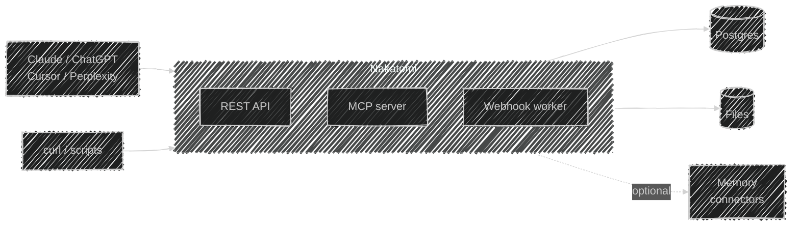

# Nakatomi

> A headless CRM built for AI agents. No UI to click. No email to sync. Just a
> clean structured API and an MCP server so Claude, ChatGPT, Cursor, and
> Perplexity can work with your CRM as a first-class tool.

[](./LICENSE)
[](https://www.python.org/)
[](https://railway.com/deploy/nakatomicrm)



- **REST API** — every primitive (contacts, companies, deals, pipelines, activities, notes, tasks, files, relationships, timeline, webhooks) is a normal HTTP endpoint
- **MCP server** — agents speak to the CRM natively at `/mcp` (streamable HTTP)
- **Multi-tenant** — workspaces, users, per-workspace API keys
- **Memory-connector friendly** — plug in DocDeploy, Supermemory, GBrain, etc. for semantic recall; Nakatomi stays the structured source of truth
- **Agent ergonomics** — bulk upsert, cursor pagination, idempotency keys, soft delete, relationship graph, self-describing `/schema` manifest, A2A agent card, `llms.txt`

## Quickstart (Docker)

```bash
git clone https://github.com/mrdulasolutions/NakatomiCRM.git
cd nakatomi
cp .env.example .env            # fill SECRET_KEY
docker compose up -d            # Postgres + app on :8000
./install.sh --seed you@example.com
# → prints your API key. save it.

curl http://localhost:8000/health
```

## Quickstart (Python)

```bash
cp .env.example .env
docker run -d --name nk-pg -e POSTGRES_PASSWORD=nakatomi -e POSTGRES_USER=nakatomi \
  -e POSTGRES_DB=nakatomi -p 5432:5432 postgres:16
pip install -r requirements.txt
alembic upgrade head
python -m scripts.seed \
  --email you@example.com --password hunter22secret \
  --workspace-name "My Workspace" --workspace-slug mine
uvicorn app.main:app --reload
```

## Deploy

### Railway (recommended)

[](https://railway.com/deploy/nakatomicrm)

Click the button above for a one-click deploy. Railway reads
[`railway.toml`](./railway.toml) and the Dockerfile, provisions Postgres,
runs migrations, and boots the app — about 60–90s end to end. You'll
be prompted for:

- `SECRET_KEY` — paste the output of `openssl rand -hex 32`
- (optional) S3 credentials if you want `STORAGE_BACKEND=s3`
- (optional) memory-connector keys (`DOCDEPLOY_API_KEY`, `SUPERMEMORY_API_KEY`, …)

Everything else has a sensible default. After the deploy promotes,
`/health` returns `{"ok": true}` and `/mcp/` speaks streamable HTTP.
Open the project URL in a browser — the **welcome page** lets you
create your workspace and an API key in a single form, with the key
shown exactly once. After that, `/` serves the JSON discovery doc and
`/bootstrap` is closed.

Full template configuration — every variable, the dashboard publish
flow, post-deploy seed commands — lives in
[docs/RAILWAY_TEMPLATE.md](./docs/RAILWAY_TEMPLATE.md).

> **Manual deploy fallback** — if you'd rather not use the template:
> `railway init` → push the repo → add a Postgres plugin → set
> `SECRET_KEY` → mount a volume at `/app/data` → deploy. The
> Dockerfile runs `alembic upgrade head && uvicorn` automatically.

### Other clouds

Any platform that runs a Dockerfile with a Postgres side-car works: Fly.io, Render, Vercel Fluid, a bare VPS, Kubernetes.

## Authentication

Two flavors:

- **User JWT** (humans / scripts): `POST /auth/signup` or `POST /auth/login` → bearer token. Send `Authorization: Bearer <jwt>` and `X-Workspace: <slug-or-id>` on every request.
- **API key** (agents): `POST /workspace/api-keys` (as an authed user). Send `Authorization: Bearer nk_<key>` — workspace is inferred from the key.

API keys are the recommended path for agents. They're cleaner for MCP clients (which typically let you set a static header in the connector config).

## MCP

- Endpoint: `https://<your-host>/mcp`
- Transport: streamable HTTP
- Auth: `Authorization: Bearer nk_<key>` in your MCP client config
- Tools: `search_contacts`, `get_contact`, `create_contact`, `update_contact`, `search_companies`, `create_company`, `list_pipelines`, `create_deal`, `move_deal_stage`, `log_activity`, `add_note`, `create_task`, `list_tasks`, `relate`, `timeline`, `memory_list_connectors`, `memory_recall`, `memory_link`, `memory_trace`, `ingest`, `describe_schema`

See [docs/MCP.md](./docs/MCP.md) for Claude Desktop, Cursor, and Custom Connector setup recipes.

## Agent interop

- **[`llms.txt`](./llms.txt)** — a machine-readable pointer file for any LLM crawler: routes, headers, auth model.
- **[`.well-known/agent.json`](./public/.well-known/agent.json)** — A2A (Agent-to-Agent) card describing capabilities for agent discovery frameworks.
- **[`docs/SKILLS.md`](./docs/SKILLS.md)** — how to install Nakatomi as a Claude Code / Claude Agent SDK skill.
- **[`.claude/skills/`](./.claude/skills/)** — two ready-to-install skills: `nakatomi-crm` (usage patterns) and `nakatomi-dashboard` (launches the local audit UI).

## Memory interop

Nakatomi does not implement semantic memory on purpose. Agents already have good
memory systems. Instead, Nakatomi ships a pluggable `MemoryConnector` interface and
adapters for the major agentic memory products (DocDeploy, Supermemory, …). Config
it via env:

```
MEMORY_CONNECTORS=docdeploy,supermemory
DOCDEPLOY_API_KEY=...
SUPERMEMORY_API_KEY=...
```

Every CRM mutation can be mirrored to those systems, and every memory write can
traceback to (and optionally trigger) a CRM change. See
[docs/MEMORY.md](./docs/MEMORY.md).

## Dashboard

Optional, off by default, local-only. Set `DASHBOARD_ENABLED=true` and visit
`http://localhost:8000/dashboard`. Or install the `nakatomi-dashboard` Claude skill
and just say **"nakatomi dashboard"** — the skill boots the stack and opens Chrome.

## Project files

- [`docs/ARCHITECTURE.md`](./docs/ARCHITECTURE.md) — visual tour of how the pieces wire together (component layout, webhook flow, ingest, export/import, memory cross-linking)
- [`docs/DEPLOYMENT_LESSONS.md`](./docs/DEPLOYMENT_LESSONS.md) — the eleven gotchas from our first Railway deploy; read before deploying to a new cloud target
- [`AgentLab.md`](./AgentLab.md) — recipes for solo agents, multi-agent swarms, harness setups, connector chains, and anti-patterns. Start here if you're wiring agents at Nakatomi.
- [Wiki](https://github.com/mrdulasolutions/NakatomiCRM/wiki) — deep dives on every subsystem (auth, webhooks, memory, ingest, deployment, troubleshooting)
- [`ROADMAP.md`](./ROADMAP.md) — what's shipped, what's in flight, what's next
- [`ETHOS.md`](./ETHOS.md) — values the project is guided by
- [`SECURITY.md`](./SECURITY.md) — responsible disclosure
- [`CONTRIBUTORS.md`](./CONTRIBUTORS.md), [`AUTHORS.md`](./AUTHORS.md)
- [`CODE_OF_CONDUCT.md`](./CODE_OF_CONDUCT.md)
- [`CHANGELOG.md`](./CHANGELOG.md)

## License

MIT. See [LICENSE](./LICENSE).
