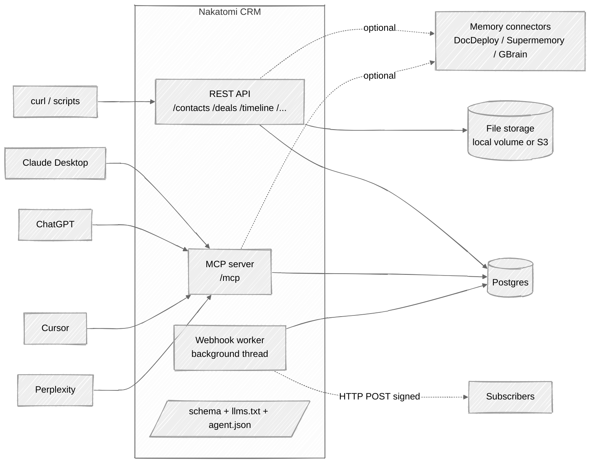
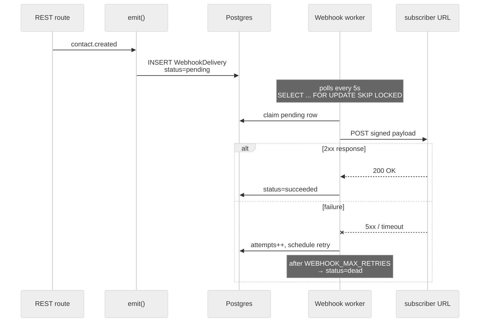
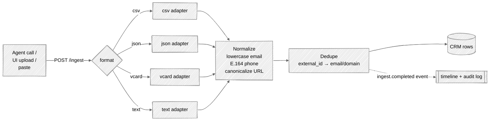
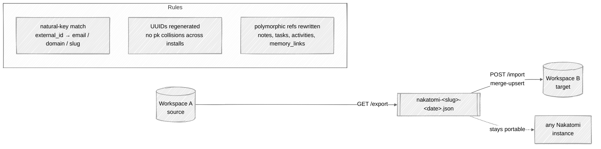
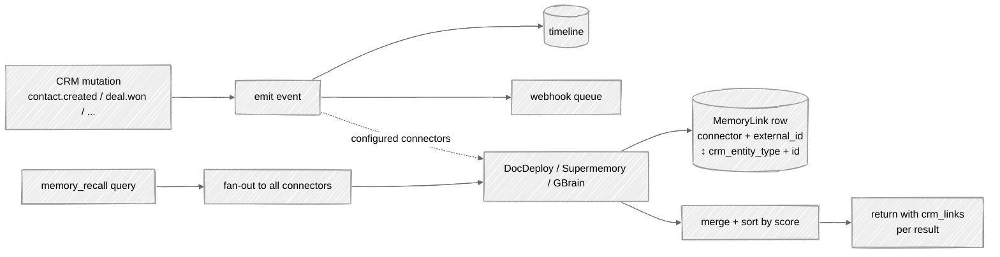

# Architecture

A quick visual tour of how Nakatomi is wired up. Diagrams are Mermaid with
the `handDrawn` look — see [`docs/diagrams/README.md`](./diagrams/README.md)
for editing notes.

## Component overview

Every box at the top is an existing agent host. Every arrow into the
Nakatomi subgraph carries `Authorization: Bearer nk_<key>`. The Schema
cluster (`/schema`, `/llms.txt`, `/.well-known/agent.json`) is how agents
discover capabilities before doing anything else.

## Durable webhook delivery

The worker thread starts in FastAPI's `lifespan`. `SELECT ... FOR UPDATE
SKIP LOCKED` makes multiple app processes safe — they race to claim rows
and don't step on each other.

## Ingest pipeline

Agents do the hard reasoning (extract entities from a PDF, reconcile fields
from two sources); Nakatomi standardizes the shape. The `dry_run` flag lets
you preview what would change before committing.

## Export / import round-trip

Webhook secrets are redacted on export and re-minted on import. File bytes
aren't inline (v2 tarball extension) — the manifest points at them; fetch
via `GET /files/{id}` if you need them on the other side.

## Memory cross-linking

The `MemoryLink` table is the bidirectional bridge. Every outbound store
creates one; every inbound webhook from a memory system creates one; every
recall decorates results with the links already on file so the agent can
pivot between structured and semantic in a single call.

## Why this shape

A few design claims the diagrams make visible:

1. **One Postgres is the source of truth.** No Redis, no Kafka, no
   eventual-consistency story to explain. The durable webhook queue and
   the rate-limit counter both live in Postgres rows.
2. **The worker is in-process.** For v1 that's fine — `SELECT ... FOR
   UPDATE SKIP LOCKED` makes it safe to scale horizontally. When volume
   justifies it, the same function that runs in the thread can be pulled
   out into a dedicated worker process with zero logic changes.
3. **Memory is always plural.** The recall fan-out design means agents can
   enable a cheap connector (Supermemory) and a self-hosted one (GBrain)
   at the same time without the CRM caring which is authoritative.
4. **Agents discover through /schema.** We don't ship SDK stubs or
   generated clients — the agent asks, learns, and acts. That's the whole
   point of MCP.
