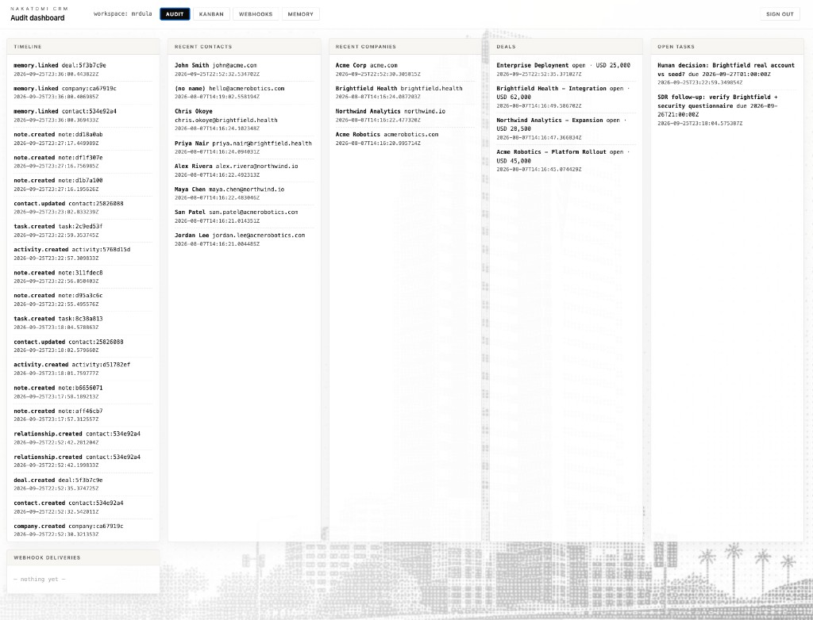
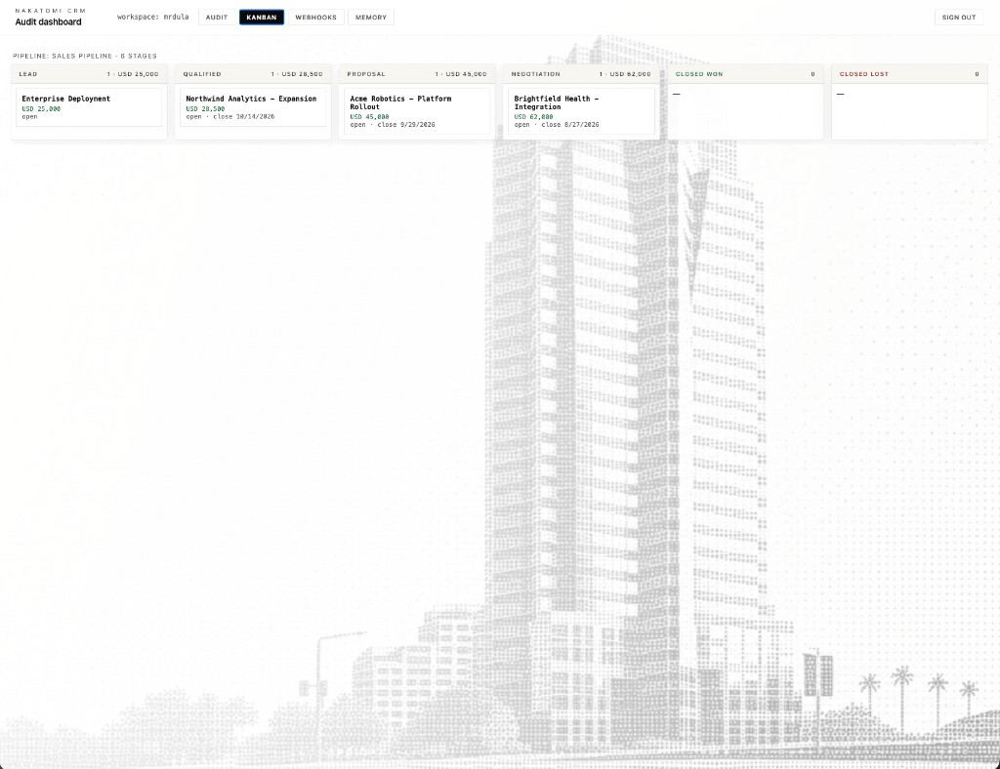
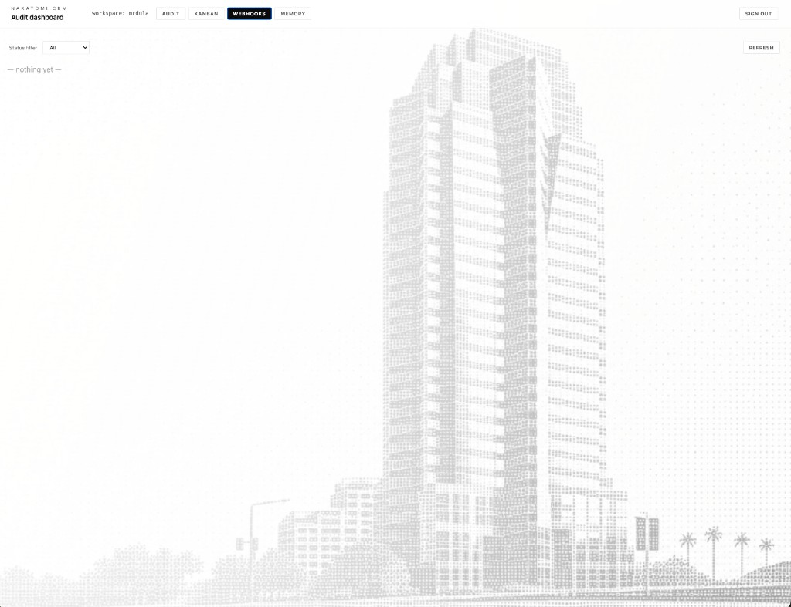
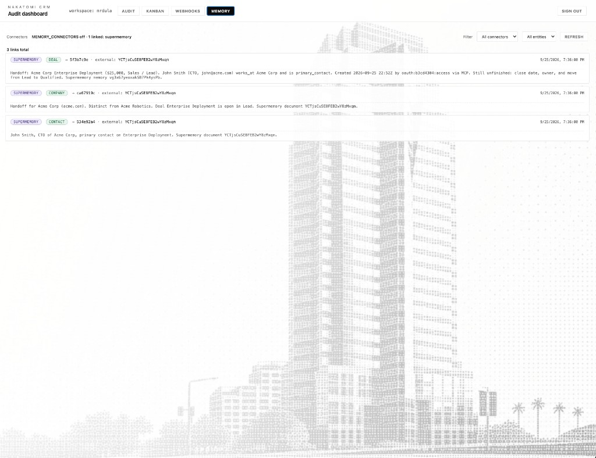

# Audit dashboard

Read-only operator UI at **`/dashboard`**. Agents use MCP/REST; humans use the dashboard to **audit** timeline, pipeline, webhooks, and memory links.

**Wiki (screenshots + tour):** [GitHub Wiki — Dashboard](https://github.com/mrdulasolutions/NakatomiCRM/wiki/Dashboard)

---

## Enable

```bash
DASHBOARD_ENABLED=true
```

Auto-enabled in `ENVIRONMENT=development` when unset. Paste an API key at login (stored in path-scoped cookie). **Sign out** clears the cookie.

Production example: https://nakatomi-production.up.railway.app/dashboard

---

## Views

| Tab | Purpose |
| --- | --- |
| **Audit** | Timeline + recent contacts/companies/deals + open tasks + webhook strip |
| **Kanban** | Read-only pipeline board (up to 4k deals) |
| **Webhooks** | Subscribers + expandable delivery log |
| **Memory** | `MemoryLink` inspector + connector env banner |

### Screenshots

Same assets as the wiki (`docs/assets/dashboard/`):

| Audit | Kanban |
| --- | --- |
|  |  |

| Webhooks | Memory |
| --- | --- |
|  |  |

The Memory tab distinguishes **`MEMORY_CONNECTORS`** (server adapters) from **link rows** created via MCP `memory_link` or REST — see [MEMORY.md](./MEMORY.md).

---

## Scopes

Use a read-capable key: `timeline:read`, entity reads, `webhooks:read`, `memory:read`, or `*`.

---

## Safety

Not a multi-user CRM UI. Cookie holds the raw key. Prefer local bind or reverse-proxy auth in production.

Launch skill: [.claude/skills/nakatomi-dashboard](../.claude/skills/nakatomi-dashboard/SKILL.md)

Implementation: `app/routers/dashboard.py`
